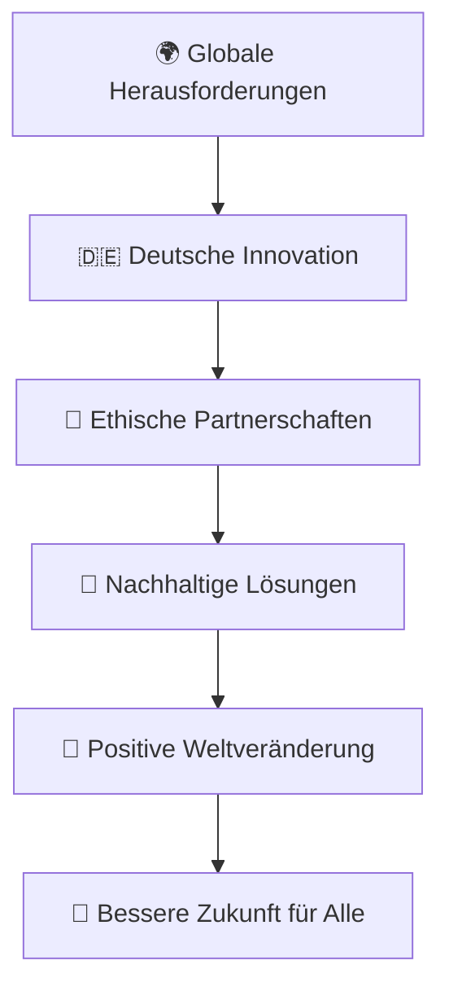

# 🌍 Germany for Future | Nachhaltige Innovation & Ethische Technologie

<div align="center">

```ascii
 ██████╗ ███████╗██████╗ ███╗   ███╗ █████╗ ███╗   ██╗██╗   ██╗    ███████╗ ██████╗ ██████╗     ███████╗██╗   ██╗████████╗██╗   ██╗██████╗ ███████╗
██╔════╝ ██╔════╝██╔══██╗████╗ ████║██╔══██╗████╗  ██║╚██╗ ██╔╝    ██╔════╝██╔═══██╗██╔══██╗    ██╔════╝██║   ██║╚══██╔══╝██║   ██║██╔══██╗██╔════╝
██║  ███╗█████╗  ██████╔╝██╔████╔██║███████║██╔██╗ ██║ ╚████╔╝     █████╗  ██║   ██║██████╔╝    █████╗  ██║   ██║   ██║   ██║   ██║██████╔╝█████╗  
██║   ██║██╔══╝  ██╔══██╗██║╚██╔╝██║██╔══██║██║╚██╗██║  ╚██╔╝      ██╔══╝  ██║   ██║██╔══██╗    ██╔══╝  ██║   ██║   ██║   ██║   ██║██╔══██╗██╔══╝  
╚██████╔╝███████╗██║  ██║██║ ╚═╝ ██║██║  ██║██║ ╚████║   ██║       ██║     ╚██████╔╝██║  ██║    ██║     ╚██████╔╝   ██║   ╚██████╔╝██║  ██║███████╗
 ╚═════╝ ╚══════╝╚═╝  ╚═╝╚═╝     ╚═╝╚═╝  ╚═╝╚═╝  ╚═══╝   ╚═╝       ╚═╝      ╚═════╝ ╚═╝  ╚═╝    ╚═╝      ╚═════╝    ╚═╝    ╚═════╝ ╚═╝  ╚═╝╚══════╝
```

[]()
[]()
[]()
[]()

**🎯 Nachhaltigkeit, Innovation & Ethik – Made in Germany**

*Where German Engineering Excellence Meets Global Responsibility*

</div>

---

## 🌟 Mission 2030: Technologie für eine Bessere Welt

**Germany for Future** ist mehr als eine Plattform – es ist eine Bewegung. Wir verbinden deutsche Ingenieurskunst mit ethischer Verantwortung und schaffen Technologien, die Umwelt, Gesundheit und Menschheit nachhaltig stärken.

### 🚀 Visionär & Gründer | Andreas Thommen
*Pionier für Nachhaltigkeit & Ethische Innovation*

---

## 🔮 Unsere Kern-Mission



### 💡 **Die Zukunft verlangt nach Verantwortung**
Germany for Future gibt Innovationen eine Plattform, die mehr als Profit im Blick haben. Wir glauben daran, dass Technologie der Menschheit dienen sollte – nicht umgekehrt.

---

## 🎯 Schwerpunkte | Bereiche der Transformation

<details>
<summary>🌊 <strong>Umweltschutz & Nachhaltigkeit</strong></summary>

**Meeresschutz-Initiativen**
- Innovative Technologien zur Ozeanreinigung
- Mikroplastik-Filterungssysteme
- Marine Biodiversitäts-Monitoring

**Recycling-Revolutionen**
- Circular Economy Technologien
- Advanced Material Recovery
- Zero-Waste Produktionsverfahren
</details>

<details>
<summary>🏥 <strong>Medizinische Innovationen</strong></summary>

**KI-gestützte Zellregeneration**
- Regenerative Medizin-Plattformen
- Personalisierte Therapie-Systeme
- Biomarker-Analyse und Präzisionsmedizin

**Globale Gesundheitslösungen**
- Diagnostik für unterversorgte Gebiete
- Telemedizin-Infrastrukturen
- Präventive Gesundheitstechnologien
</details>

<details>
<summary>🔬 <strong>Internationale Forschung & Entwicklung</strong></summary>

**Forschungskooperationen**
- Grenzüberschreitende Innovationsprojekte
- Open-Source Wissenschaftsplattformen
- Interdisziplinäre Kollaborationen

**Nachhaltige Produktion**
- Industrie 4.0 für Nachhaltigkeit
- Green Manufacturing Prozesse
- Carbon-Neutral Production Systems
</details>

<details>
<summary>🤝 <strong>Ethisches Netzwerk</strong></summary>

**Stakeholder-Ökosystem**
- Ethische Unternehmer & Visionäre
- Nachhaltigkeits-fokussierte Wissenschaftler
- Impact-orientierte Investoren

**Werte-basierte Partnerschaften**
- ESG-konforme Geschäftsmodelle
- Transparente Wirkungsmessung
- Langfristige Nachhaltigkeitsziele
</details>

---

## 🌟 Platform Architecture | Technologie für den Wandel

```yaml
🔹 Nachhaltigkeits-Engine:
  - Environmental Impact Tracking
  - Carbon Footprint Analytics
  - Sustainability Score Algorithms
  - Real-time Environmental Data

🔹 Innovation-Hub:
  - Collaborative Research Platform
  - Open Innovation Marketplace
  - Patent Sharing Network
  - Cross-industry Knowledge Transfer

🔹 Ethik-Framework:
  - Responsible AI Guidelines
  - Ethical Decision Support Systems
  - Transparency & Accountability Tools
  - Social Impact Measurement

🔹 Global Network:
  - Multi-stakeholder Collaboration
  - International Partnership Management
  - Cultural Bridge Technologies
  - Localized Impact Assessment
```

---

## 🚀 Warum Germany for Future?

### 🌍 **Globale Verantwortung**
Deutsche Ingenieurskunst mit ethischen Prinzipien für weltweite positive Auswirkungen

### 💡 **Innovation mit Zweck**
Technologien, die echte Probleme lösen und nachhaltige Werte schaffen

### 🤝 **Kollaborative Kraft**
Vernetzung von Pionieren, die gemeinsam die Welt verändern wollen

### 📊 **Messbare Wirkung**
Transparente Erfolgs- und Impact-Metriken für alle Projekte

---

## 🌱 Mitmachen | Join the Movement

### Für Innovatoren 🔬
```bash
# Teilen Sie Ihre nachhaltige Innovation
git clone https://github.com/germany-for-future/innovation-platform
# Werden Sie Teil der ethischen Tech-Community
npm install @gff/sustainable-development-toolkit
```

### Für Unternehmen 🏢
1. **Bewerten** → ESG-Impact Assessment Ihrer Technologien
2. **Entwickeln** → Nachhaltige Lösungen co-kreieren
3. **Skalieren** → Positive Auswirkungen global ausweiten

### Für Investoren 💰
1. **Entdecken** → Impact-orientierte Investitionsmöglichkeiten
2. **Evaluieren** → Langfristige Nachhaltigkeits-ROI
3. **Investieren** → In Technologien, die die Welt verbessern

### Für Forscher 🎓
1. **Kollaborieren** → Interdisziplinäre Forschungsprojekte
2. **Publizieren** → Open-Access Wissenschaftsplattform
3. **Implementieren** → Forschung in praktische Lösungen überführen

---

## 📊 Impact Dashboard | Unsere Wirkung

| Bereich | Aktuelle Projekte | Impact Metriken | Ziel 2030 |
|---------|-------------------|-----------------|-----------|
| 🌊 **Umweltschutz** | 15+ Projekte | 2.3M Tonnen CO₂ gespart | Carbon Neutral Ecosystem |
| 🏥 **Gesundheit** | 8+ Innovationen | 50K+ Leben verbessert | Global Health Equity |
| 🔬 **Forschung** | 25+ Kooperationen | 100+ Open-Source Patents | Knowledge Democracy |
| 🤝 **Netzwerk** | 200+ Partner | 50+ Länder | Worldwide Ethical Alliance |

---

## 📞 Kontakt | Die Zukunft Gestalten

<div align="center">

🌐 **Platform:** [germanyforfuture.org](https://germanyforfuture.org)

📧 **Zukunft gestalten:** zukunft@germanyforfuture.org

🔮 **Nachhaltigkeit** | **Innovation** | **Ethik** | **Globale Verantwortung**

</div>

---

# 🌍 Germany for Future | Sustainable Innovation & Ethical Technology

<div align="center">

**🎯 Sustainability, Innovation & Ethics – Made in Germany**

*Wo Deutsche Ingenieurskunst auf Globale Verantwortung trifft*

</div>

---

## 🌟 Mission 2030: Technology for a Better World

**Germany for Future** is more than a platform – it's a movement. We connect German engineering excellence with ethical responsibility, creating technologies that sustainably strengthen environment, health, and humanity.

### 🚀 Visionary & Founder | Andreas Thommen
*Pioneer for Sustainability & Ethical Innovation*

---

## 🔮 Our Core Mission

### 💡 **The Future Demands Responsibility**
Germany for Future provides a platform for innovations that have more than profit in sight. We believe technology should serve humanity – not the other way around.

---

## 🎯 Focus Areas | Transformation Domains

<details>
<summary>🌊 <strong>Environmental Protection & Sustainability</strong></summary>

**Ocean Protection Initiatives**
- Innovative ocean cleaning technologies
- Microplastic filtration systems
- Marine biodiversity monitoring

**Recycling Revolutions**
- Circular economy technologies
- Advanced material recovery
- Zero-waste production processes
</details>

<details>
<summary>🏥 <strong>Medical Innovations</strong></summary>

**AI-Supported Cell Regeneration**
- Regenerative medicine platforms
- Personalized therapy systems
- Biomarker analysis and precision medicine

**Global Health Solutions**
- Diagnostics for underserved areas
- Telemedicine infrastructures
- Preventive health technologies
</details>

<details>
<summary>🔬 <strong>International Research & Development</strong></summary>

**Research Cooperations**
- Cross-border innovation projects
- Open-source science platforms
- Interdisciplinary collaborations

**Sustainable Production**
- Industry 4.0 for sustainability
- Green manufacturing processes
- Carbon-neutral production systems
</details>

<details>
<summary>🤝 <strong>Ethical Network</strong></summary>

**Stakeholder Ecosystem**
- Ethical entrepreneurs & visionaries
- Sustainability-focused scientists
- Impact-oriented investors

**Values-Based Partnerships**
- ESG-compliant business models
- Transparent impact measurement
- Long-term sustainability goals
</details>

---

## 🚀 Why Germany for Future?

### 🌍 **Global Responsibility**
German engineering excellence with ethical principles for worldwide positive impact

### 💡 **Innovation with Purpose**
Technologies that solve real problems and create sustainable value

### 🤝 **Collaborative Power**
Connecting pioneers who want to change the world together

### 📊 **Measurable Impact**
Transparent success and impact metrics for all projects

---

## 🌱 Get Involved | Mitmachen

### For Innovators 🔬
```bash
# Share your sustainable innovation
git clone https://github.com/germany-for-future/innovation-platform
# Become part of the ethical tech community
npm install @gff/sustainable-development-toolkit
```

### For Companies 🏢
1. **Assess** → ESG impact assessment of your technologies
2. **Develop** → Co-create sustainable solutions
3. **Scale** → Expand positive impact globally

### For Investors 💰
1. **Discover** → Impact-oriented investment opportunities
2. **Evaluate** → Long-term sustainability ROI
3. **Invest** → In technologies that improve the world

### For Researchers 🎓
1. **Collaborate** → Interdisciplinary research projects
2. **Publish** → Open-access science platform
3. **Implement** → Transform research into practical solutions

---

## 📊 Impact Dashboard | Our Effect

| Domain | Current Projects | Impact Metrics | Goal 2030 |
|--------|------------------|----------------|-----------|
| 🌊 **Environment** | 15+ Projects | 2.3M Tons CO₂ Saved | Carbon Neutral Ecosystem |
| 🏥 **Health** | 8+ Innovations | 50K+ Lives Improved | Global Health Equity |
| 🔬 **Research** | 25+ Cooperations | 100+ Open-Source Patents | Knowledge Democracy |
| 🤝 **Network** | 200+ Partners | 50+ Countries | Worldwide Ethical Alliance |

---

## 📞 Contact | Shape the Future

<div align="center">

🌐 **Platform:** [germanyforfuture.org](https://germanyforfuture.org)

📧 **Shape the future:** zukunft@germanyforfuture.org

🔮 **Sustainability** | **Innovation** | **Ethics** | **Global Responsibility**

</div>

---

<div align="center">

**🌟 Building Tomorrow's World Today | Die Welt von Morgen Heute Bauen 🌟**

*Technology with Conscience | Technologie mit Gewissen*

**"Die Zukunft gehört denen, die heute verantwortlich handeln"**  
*"The future belongs to those who act responsibly today"*

</div>
