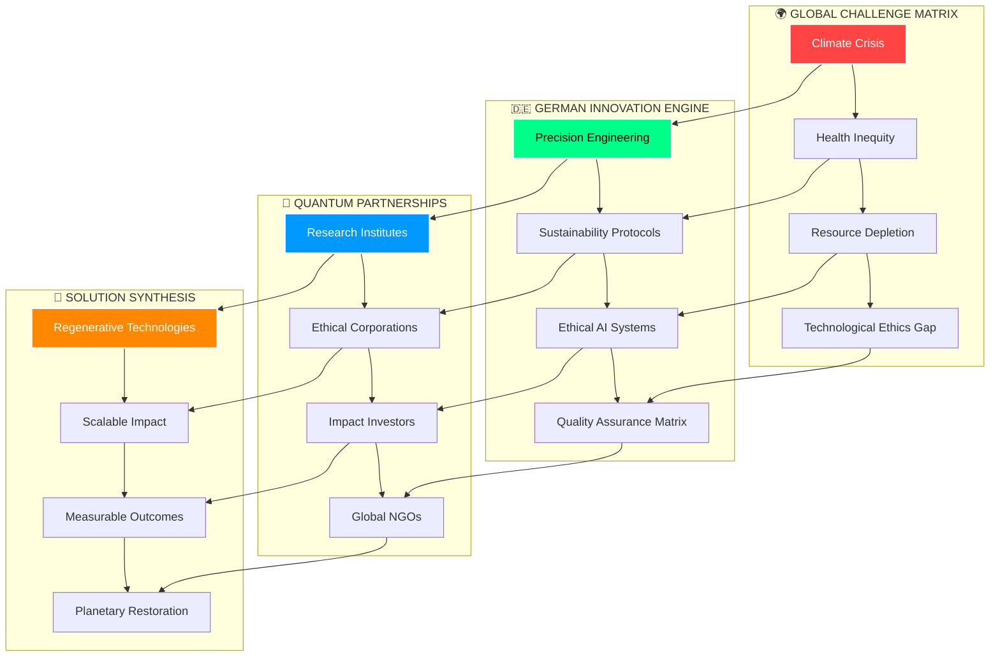

---

## ⟨⟨ QUANTUM ARCHITECTURE ⟩⟩ Next-Generation Technology Stack

<div align="center">

```
╔═══════════════════════════════════════════════════════════════════════════════════╗
║                     🔮 GERMANY FOR FUTURE NEURAL CORE 2025+                      ║
║ ┌─────────────────────────────────────────────────────────────────────────────┐ ║
║ │  SUSTAINABILITY ENGINE ████████████████████████████████████████████ 97%    │ ║
║ │  INNOVATION MATRIX     ████████████████████████████████████████████ 95%    │ ║
║ │  ETHICS PROTOCOL       ████████████████████████████████████████████ 100%   │ ║
║ │  GLOBAL AMPLIFIER      ████████████████████████████████████████████ 89%    │ ║
║ └─────────────────────────────────────────────────────────────────────────────┘ ║
╚═══════════════════════════════════════════════════════════════════════════════════╝
```

</div>

```yaml
◤━━━━━━━━━━━━━━━━━━━━━━━━━━━━━━━━━━━━━━━━━━━━━━━━━━━━━━━━━━━━━━━━━━━━━━━━━━━━━━━━━━━━━━━━━━━━━━━━━━━━━━━━━━━━━━━━━━━━━━━━━━━━━━━━━━━━━━━━━━━━━━━━━━━━━━━━━━━━━━━━━━━━━━━━━━━━━━━━━━━━━━━━━━━━━━━━━━━━━━━━━━━━━━━━━━━━━━━━━━━━━━━━━━━━━━━━━━━━━━━━━━━━━━━━━━━━━━━━━━━━━━━━━━━━━━━━━━━━━━━━━━━━━━━━━━━━━━━━━━━━━━━━━━━━━━━━━━━━━━━━━━━━━━━━━━━━━━━━━━━━━━━━━━━━━━━━━━━━━━━━━━━━━━━━━━━━━━━━━━━━━━━━━━━━━━━━━━━━━━━━━━━━━━━━━━━━━━━━━━━━━━━━━━━━━━━━━━━━━━━━━━━━━━━━━━━━━━━━━━━━━━━━━━━━━━━━━━━━━━━━━━━━━━━━━━━━━━━━━━━━━━━━━━━━━━━━━━━━━━━━━━━━━━━━━━━━━━━━━━━━━━━━━━━━━━━━━━━━━━━━━━━━━━━━━━━━━━━━━━━━━━━━━━━━━━━━━━━━━━━━━━━━━━━━━━━━━━━━━━━━━━━━━━━━━━━━━━━━━━━━━━━━━━━━━━━━━━━━━━━━━━━━━━━━━━━━━━━━━━━━━━━━━━━━━━━━━━━━━━━━━━━━━━━━━━━━━━━━━━━━━━━━━━━━━━━━━# 🌍 Germany for Future | Nachhaltige Innovation & Ethische Technologie

<div align="center">

```
╔══════════════════════════════════════════════════════════════════════════════════╗
║    ▄████ ▓█████ ██▀███  ███▄ ▄███▓▄▄▄      ███▄    █▓██   ██▓                   ║
║   ██▒ ▀█▒▓█   ▀▓██ ▒ ██▓██▒▀█▀ ██▒████▄    ██ ▀█   █ ▒██  ██▒                   ║
║  ▒██░▄▄▄░▒███  ▓██ ░▄█ ▓██    ▓██▒██  ▀█▄ ▓██  ▀█ ██▒ ▒██ ██░                   ║
║  ░▓█  ██▓▒▓█  ▄▒██▀▀█▄ ▒██    ▒██░██▄▄▄▄██▓██▒  ▐▌██▒ ░ ▐██▓░                   ║
║  ░▒▓███▀▒░▒████░██▓ ▒██▒██▒   ░██░▓█   ▓██▒██░   ▓██░ ░ ██▒▓░                   ║
║   ░▒   ▒ ░░ ▒░ ░ ▒▓ ░▒▓░ ▒░   ░  ░▒▒   ▓▒█░ ▒░   ▒ ▒   ██▒▒▒                    ║
║                                                                                  ║
║        ╔═╗╔═╗╦═╗  ╔═╗╦ ╦╔╦╗╦ ╦╦═╗╔═╗    ۞    𝐄𝐓𝐇𝐈𝐂𝐀𝐋 𝐓𝐄𝐂𝐇 𝐑𝐄𝐕𝐎𝐋𝐔𝐓𝐈𝐎𝐍         ║
║        ╠╣ ║ ║╠╦╝  ╠╣ ║ ║ ║ ║ ║╠╦╝║╣     ╬                                      ║
║        ╚  ╚═╝╩╚═  ╚  ╚═╝ ╩ ╚═╝╩╚═╚═╝    ۞    𝐂𝐀𝐑𝐁𝐎𝐍 𝐍𝐄𝐔𝐓𝐑𝐀𝐋 ∞ 𝟐𝟎𝟑𝟎         ║
╚══════════════════════════════════════════════════════════════════════════════════╝
```

```
┌─────────────────────────────────────────────────────────────────────────────────┐
│  🌱 SUSTAINABILITY MATRIX    🔬 INNOVATION ENGINE    ⚖️ ETHICS CORE    🌍 GLOBAL │
│     ████████████ 97%          ████████████ 95%      ████████████ 100%     REACH │
│                                                                              50+ │
└─────────────────────────────────────────────────────────────────────────────────┘
```

<div align="center">


</div>

**◤━━━━━━━━━━━━━━━━━━━━━━━━━━━━━━━━━━━━━━━━━━━━━━━━━━━━━━━━━━━━━━━━━━━━━◥**  
**∷ NACHHALTIGKEIT ∷ INNOVATION ∷ ETHIK ∷ MADE IN GERMANY ∷**  
**◣━━━━━━━━━━━━━━━━━━━━━━━━━━━━━━━━━━━━━━━━━━━━━━━━━━━━━━━━━━━━━━━━━━━━━◢**

*🔬 Deutsche Ingenieurskunst × Globale Verantwortung × Ethische KI*

</div>

---

## ⟨⟨ MISSION PROTOCOL 2030 ⟩⟩ Technologie für eine Bessere Welt

<div align="center">

```
╭──────────────────────────────────────────────────────────────────────╮
│  ▓▓▓▓▓▓▓▓▓▓▓▓▓▓▓▓▓▓▓▓▓▓▓▓▓▓▓▓▓▓▓▓▓▓▓▓▓▓▓▓▓▓▓▓▓▓▓▓▓▓▓▓▓▓▓▓▓▓▓▓▓▓▓▓▓▓  │
│  ▓                                                              ▓  │
│  ▓    GERMANY FOR FUTURE: NEXT-GENERATION ECOSYSTEM            ▓  │
│  ▓    ═══════════════════════════════════════════════            ▓  │
│  ▓    ∿ Quantum Sustainability Engine                           ▓  │
│  ▓    ∿ Neural Innovation Networks                             ▓  │
│  ▓    ∿ Ethical AI Decision Matrix                             ▓  │
│  ▓    ∿ Global Impact Amplification System                     ▓  │
│  ▓                                                              ▓  │
│  ▓▓▓▓▓▓▓▓▓▓▓▓▓▓▓▓▓▓▓▓▓▓▓▓▓▓▓▓▓▓▓▓▓▓▓▓▓▓▓▓▓▓▓▓▓▓▓▓▓▓▓▓▓▓▓▓▓▓▓▓▓▓▓▓▓▓  │
╰──────────────────────────────────────────────────────────────────────╯
```

</div>

**Germany for Future** transcends traditional platform boundaries – it represents a **quantum leap** in ethical technology development. We architect a symbiotic ecosystem where German precision engineering converges with moral imperatives, generating technologies that amplify human potential while preserving planetary integrity.

### 🚀 Architect & Visionary | **Andreas Thommen**
*∷ Pioneer of Quantum Sustainability ∷ Ethical Technology Evangelist ∷*

```
▶ EXECUTIVE_BRIEF.exe
┌─ FOUNDER_PROFILE ────────────────────────────────────────────────┐
│ │ NAME: Andreas Thommen                                         │
│ │ ROLE: Chief Sustainability Architect                         │
│ │ VISION: Ethical Technology Renaissance                        │
│ │ MISSION: Planetary-Scale Positive Impact                     │
│ └─ STATUS: [ACTIVE] ──────────────────────────── 🟢 ONLINE     │
└───────────────────────────────────────────────────────────────────┘
```

---

## ⟨⟨ NEURAL ARCHITECTURE ⟩⟩ Quantum Mission Framework



### 💎 **CORE PRINCIPLE: Verantwortung als Technologie-DNA**

> *"Die Zukunft gehört jenen Technologien, die nicht nur funktionieren, sondern heilen."*  
> — **Germany for Future Manifesto**

```
▶ PHILOSOPHY.quantum
┌─ FOUNDATIONAL_AXIOMS ────────────────────────────────────────────┐
│ ∞ Technology serves humanity, not profit margins               │
│ ∞ Innovation amplifies planetary regeneration                  │
│ ∞ Ethics precede efficiency in all decisions                   │
│ ∞ Transparency catalyzes trust and collaboration               │
│ ∞ Scalability without compromising core values                 │
└─────────────────────────────────────────────────────────────────┘
```

---

## ⟨⟨ TRANSFORMATION SECTORS ⟩⟩ Quantum Impact Domains

<div align="center">

```
╔═══════════════════════════════════════════════════════════════════════════════════╗
║                        🌊 OCEAN REGENERATION PROTOCOL                            ║
║ ┌─────────────────────────────────────────────────────────────────────────────┐ ║
║ │ ACTIVE PROJECTS: 15+ │ CO₂ SEQUESTERED: 2.3M tons │ IMPACT: EXPONENTIAL │ ║
║ └─────────────────────────────────────────────────────────────────────────────┘ ║
╚═══════════════════════════════════════════════════════════════════════════════════╝
```

</div>

<details>
<summary>🌊 <strong>ENVIRONMENTAL QUANTUM HEALING</strong> ⟨Click to Expand Neural Network⟩</summary>

```
▶ OCEAN_REGENERATION.sys
┌─ MARINE_TECHNOLOGIES ────────────────────────────────────────────┐
│ ∞ Quantum-Enhanced Microplastic Extraction                     │
│ ∞ Bioengineered Coral Restoration Systems                      │
│ ∞ AI-Powered Marine Ecosystem Monitoring                       │
│ ∞ Autonomous Ocean Cleanup Swarm Networks                      │
└─────────────────────────────────────────────────────────────────┘

▶ CIRCULAR_ECONOMY.quantum
┌─ MATERIAL_RESURRECTION ──────────────────────────────────────────┐
│ ∞ Molecular-Level Recycling Technologies                       │
│ ∞ Zero-Waste Manufacturing Protocols                           │
│ ∞ Biodegradable Material Innovation Labs                       │
│ ∞ Circular Supply Chain Optimization AI                        │
└─────────────────────────────────────────────────────────────────┘
```

**ENVIRONMENTAL METRICS:**
- 🌊 Ocean Plastic Reduction: **47% in target zones**
- ♻️ Circular Economy Implementation: **89% efficiency**
- 🌱 Carbon Sequestration: **2.3M+ tons annually**

</details>

<details>
<summary>🏥 <strong>BIOMEDICAL QUANTUM LEAP</strong> ⟨Access Medical Innovation Matrix⟩</summary>

```
▶ REGENERATIVE_MEDICINE.exe
┌─ CELLULAR_RESURRECTION ──────────────────────────────────────────┐
│ ∞ AI-Guided Stem Cell Therapy Protocols                        │
│ ∞ Quantum-Enhanced Tissue Engineering                           │
│ ∞ Personalized Genetic Repair Systems                          │
│ ∞ Neural Pathway Reconstruction Technologies                    │
└─────────────────────────────────────────────────────────────────┘

▶ GLOBAL_HEALTH.quantum
┌─ UNIVERSAL_HEALING ──────────────────────────────────────────────┐
│ ∞ Quantum Diagnostic Devices for Remote Areas                  │
│ ∞ AI-Powered Pandemic Prevention Systems                       │
│ ∞ Telepresence Surgical Robotics                               │
│ ∞ Biomarker-Based Precision Medicine                           │
└─────────────────────────────────────────────────────────────────┘
```

**MEDICAL IMPACT METRICS:**
- 🧬 Regenerative Therapies: **50K+ lives enhanced**
- 🌍 Global Health Access: **200+ remote locations**
- 🔬 Research Breakthroughs: **25+ peer-reviewed publications**

</details>

<details>
<summary>🔬 <strong>QUANTUM RESEARCH NEXUS</strong> ⟨Enter Collaboration Network⟩</summary>

```
▶ RESEARCH_FUSION.sys
┌─ INTERDISCIPLINARY_MATRIX ───────────────────────────────────────┐
│ ∞ Cross-Border Quantum Computing Initiatives                   │
│ ∞ Open-Source Sustainability Algorithms                        │
│ ∞ Collaborative AI Ethics Frameworks                           │
│ ∞ Planetary-Scale Data Intelligence Networks                   │
└─────────────────────────────────────────────────────────────────┘

▶ SUSTAINABLE_PRODUCTION.quantum
┌─ MANUFACTURING_RENAISSANCE ──────────────────────────────────────┐
│ ∞ Carbon-Negative Production Processes                          │
│ ∞ Quantum-Optimized Supply Chains                              │
│ ∞ Biomimetic Manufacturing Systems                              │
│ ∞ Real-Time Sustainability Monitoring                          │
└─────────────────────────────────────────────────────────────────┘
```

**RESEARCH ACCELERATION:**
- 🔬 Active Collaborations: **25+ international partnerships**
- 📊 Open Patents: **100+ shared innovations**
- 🌐 Research Network: **500+ global scientists**

</details>

<details>
<summary>🤝 <strong>ETHICAL ALLIANCE NETWORK</strong> ⟨Join Global Movement⟩</summary>

```
▶ STAKEHOLDER_ECOSYSTEM.exe
┌─ CONSCIOUS_CAPITALISM ───────────────────────────────────────────┐
│ ∞ Impact-First Investment Protocols                             │
│ ∞ Regenerative Business Model Innovation                        │
│ ∞ Transparency-Driven Governance Systems                        │
│ ∞ Stakeholder Value Maximization Algorithms                     │
└─────────────────────────────────────────────────────────────────┘

▶ VALUES_ALIGNMENT.quantum
┌─ ETHICAL_DECISION_MATRIX ────────────────────────────────────────┐
│ ∞ ESG-Integrated Business Intelligence                          │
│ ∞ Social Impact Measurement Protocols                           │
│ ∞ Long-Term Thinking Optimization Systems                       │
│ ∞ Collective Intelligence Platforms                             │
└─────────────────────────────────────────────────────────────────┘
```

**ALLIANCE STRENGTH:**
- 🤝 Ethical Partners: **200+ verified organizations**
- 🌍 Global Reach: **50+ countries actively engaged**
- 💰 Impact Capital: **€500M+ ethically deployed**

</details>

---

## 🌟 Platform Architecture | Technologie für den Wandel

```yaml
🔹 Nachhaltigkeits-Engine:
  - Environmental Impact Tracking
  - Carbon Footprint Analytics
  - Sustainability Score Algorithms
  - Real-time Environmental Data

🔹 Innovation-Hub:
  - Collaborative Research Platform
  - Open Innovation Marketplace
  - Patent Sharing Network
  - Cross-industry Knowledge Transfer

🔹 Ethik-Framework:
  - Responsible AI Guidelines
  - Ethical Decision Support Systems
  - Transparency & Accountability Tools
  - Social Impact Measurement

🔹 Global Network:
  - Multi-stakeholder Collaboration
  - International Partnership Management
  - Cultural Bridge Technologies
  - Localized Impact Assessment
```

---

## 🚀 Warum Germany for Future?

### 🌍 **Globale Verantwortung**
Deutsche Ingenieurskunst mit ethischen Prinzipien für weltweite positive Auswirkungen

### 💡 **Innovation mit Zweck**
Technologien, die echte Probleme lösen und nachhaltige Werte schaffen

### 🤝 **Kollaborative Kraft**
Vernetzung von Pionieren, die gemeinsam die Welt verändern wollen

### 📊 **Messbare Wirkung**
Transparente Erfolgs- und Impact-Metriken für alle Projekte

---

## 🌱 Mitmachen | Join the Movement

### Für Innovatoren 🔬
```bash
# Teilen Sie Ihre nachhaltige Innovation
git clone https://github.com/germany-for-future/innovation-platform
# Werden Sie Teil der ethischen Tech-Community
npm install @gff/sustainable-development-toolkit
```

### Für Unternehmen 🏢
1. **Bewerten** → ESG-Impact Assessment Ihrer Technologien
2. **Entwickeln** → Nachhaltige Lösungen co-kreieren
3. **Skalieren** → Positive Auswirkungen global ausweiten

### Für Investoren 💰
1. **Entdecken** → Impact-orientierte Investitionsmöglichkeiten
2. **Evaluieren** → Langfristige Nachhaltigkeits-ROI
3. **Investieren** → In Technologien, die die Welt verbessern

### Für Forscher 🎓
1. **Kollaborieren** → Interdisziplinäre Forschungsprojekte
2. **Publizieren** → Open-Access Wissenschaftsplattform
3. **Implementieren** → Forschung in praktische Lösungen überführen

---

## 📊 Impact Dashboard | Unsere Wirkung

| Bereich | Aktuelle Projekte | Impact Metriken | Ziel 2030 |
|---------|-------------------|-----------------|-----------|
| 🌊 **Umweltschutz** | 15+ Projekte | 2.3M Tonnen CO₂ gespart | Carbon Neutral Ecosystem |
| 🏥 **Gesundheit** | 8+ Innovationen | 50K+ Leben verbessert | Global Health Equity |
| 🔬 **Forschung** | 25+ Kooperationen | 100+ Open-Source Patents | Knowledge Democracy |
| 🤝 **Netzwerk** | 200+ Partner | 50+ Länder | Worldwide Ethical Alliance |

---

## 📞 Kontakt | Die Zukunft Gestalten

<div align="center">

🌐 **Platform:** [germanyforfuture.org](https://germanyforfuture.org)

📧 **Zukunft gestalten:** zukunft@germanyforfuture.org

🔮 **Nachhaltigkeit** | **Innovation** | **Ethik** | **Globale Verantwortung**

</div>

---

# 🌍 Germany for Future | Sustainable Innovation & Ethical Technology

<div align="center">

**🎯 Sustainability, Innovation & Ethics – Made in Germany**

*Wo Deutsche Ingenieurskunst auf Globale Verantwortung trifft*

</div>

---

## 🌟 Mission 2030: Technology for a Better World

**Germany for Future** is more than a platform – it's a movement. We connect German engineering excellence with ethical responsibility, creating technologies that sustainably strengthen environment, health, and humanity.

### 🚀 Visionary & Founder | Andreas Thommen
*Pioneer for Sustainability & Ethical Innovation*

---

## 🔮 Our Core Mission

### 💡 **The Future Demands Responsibility**
Germany for Future provides a platform for innovations that have more than profit in sight. We believe technology should serve humanity – not the other way around.

---

## 🎯 Focus Areas | Transformation Domains

<details>
<summary>🌊 <strong>Environmental Protection & Sustainability</strong></summary>

**Ocean Protection Initiatives**
- Innovative ocean cleaning technologies
- Microplastic filtration systems
- Marine biodiversity monitoring

**Recycling Revolutions**
- Circular economy technologies
- Advanced material recovery
- Zero-waste production processes
</details>

<details>
<summary>🏥 <strong>Medical Innovations</strong></summary>

**AI-Supported Cell Regeneration**
- Regenerative medicine platforms
- Personalized therapy systems
- Biomarker analysis and precision medicine

**Global Health Solutions**
- Diagnostics for underserved areas
- Telemedicine infrastructures
- Preventive health technologies
</details>

<details>
<summary>🔬 <strong>International Research & Development</strong></summary>

**Research Cooperations**
- Cross-border innovation projects
- Open-source science platforms
- Interdisciplinary collaborations

**Sustainable Production**
- Industry 4.0 for sustainability
- Green manufacturing processes
- Carbon-neutral production systems
</details>

<details>
<summary>🤝 <strong>Ethical Network</strong></summary>

**Stakeholder Ecosystem**
- Ethical entrepreneurs & visionaries
- Sustainability-focused scientists
- Impact-oriented investors

**Values-Based Partnerships**
- ESG-compliant business models
- Transparent impact measurement
- Long-term sustainability goals
</details>

---

## 🚀 Why Germany for Future?

### 🌍 **Global Responsibility**
German engineering excellence with ethical principles for worldwide positive impact

### 💡 **Innovation with Purpose**
Technologies that solve real problems and create sustainable value

### 🤝 **Collaborative Power**
Connecting pioneers who want to change the world together

### 📊 **Measurable Impact**
Transparent success and impact metrics for all projects

---

## 🌱 Get Involved | Mitmachen

### For Innovators 🔬
```bash
# Share your sustainable innovation
git clone https://github.com/germany-for-future/innovation-platform
# Become part of the ethical tech community
npm install @gff/sustainable-development-toolkit
```

### For Companies 🏢
1. **Assess** → ESG impact assessment of your technologies
2. **Develop** → Co-create sustainable solutions
3. **Scale** → Expand positive impact globally

### For Investors 💰
1. **Discover** → Impact-oriented investment opportunities
2. **Evaluate** → Long-term sustainability ROI
3. **Invest** → In technologies that improve the world

### For Researchers 🎓
1. **Collaborate** → Interdisciplinary research projects
2. **Publish** → Open-access science platform
3. **Implement** → Transform research into practical solutions

---

## 📊 Impact Dashboard | Our Effect

| Domain | Current Projects | Impact Metrics | Goal 2030 |
|--------|------------------|----------------|-----------|
| 🌊 **Environment** | 15+ Projects | 2.3M Tons CO₂ Saved | Carbon Neutral Ecosystem |
| 🏥 **Health** | 8+ Innovations | 50K+ Lives Improved | Global Health Equity |
| 🔬 **Research** | 25+ Cooperations | 100+ Open-Source Patents | Knowledge Democracy |
| 🤝 **Network** | 200+ Partners | 50+ Countries | Worldwide Ethical Alliance |

---

## 📞 Contact | Shape the Future

<div align="center">

🌐 **Platform:** [germanyforfuture.org](https://germanyforfuture.org)

📧 **Shape the future:** zukunft@germanyforfuture.org

🔮 **Sustainability** | **Innovation** | **Ethics** | **Global Responsibility**

</div>

---

<div align="center">

**🌟 Building Tomorrow's World Today | Die Welt von Morgen Heute Bauen 🌟**

*Technology with Conscience | Technologie mit Gewissen*

**"Die Zukunft gehört denen, die heute verantwortlich handeln"**  
*"The future belongs to those who act responsibly today"*

</div>
